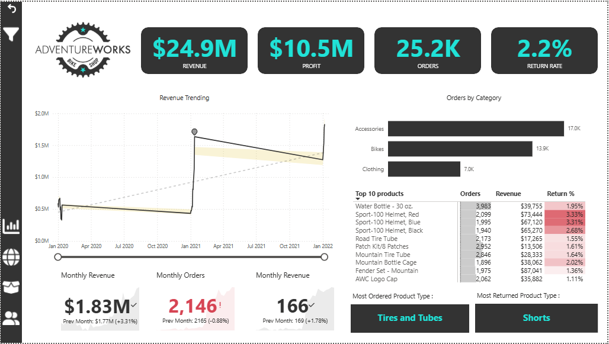
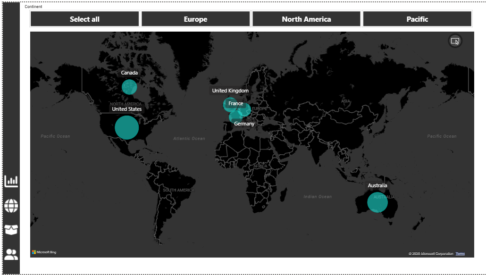
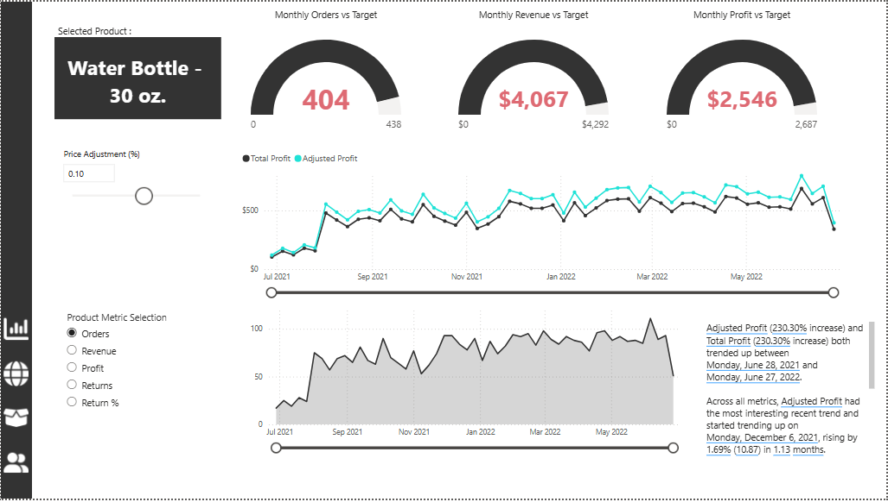
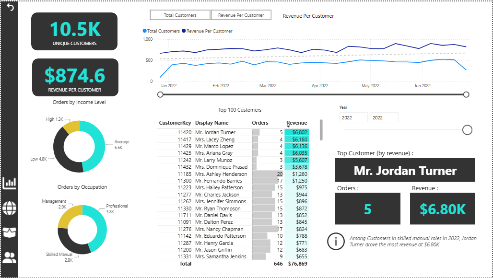

# Adventure Works Sales Dashboard

A comprehensive Power BI dashboard analyzing sales performance for a global cycling equipment manufacturing company.

**Created with:** Maven Analytics Power BI Desktop Course

---

## 📊 Key Metrics

- **Total Revenue:** $24.9M
- **Total Orders:** 25,200
- **Total Profit:** $10.5M
- **Return Rate:** 2.2%

---

## 🖼️ Dashboard Pages

### 1. Executive Summary

High-level overview of all key business metrics and KPIs.

---

### 2. Geographic Analysis

Sales distribution across regions and territories.

---

### 3. Product Analysis

Individual product performance metrics vs targets.

---

### 4. Customer Analysis

Customer segmentation and demographic analysis.

---

### 5. Key Influencers

Key factors and segments driving business performance.

---

## 🛠️ Tools & Skills

- **Power Query** - Data extraction and transformation
- **DAX** - Advanced calculations and formulas
- **Data Modeling** - Relational database design
- **Interactive Dashboards** - Filters and drill-throughs
- **KPI Cards & Gauge Charts** - Performance metrics
- **Geographic Maps** - Regional analysis

---

## 📥 Download & Use

**File:** `MavenAnalytics_FullProject_HarshGulati.pbix`

1. Download the file
2. Open in Microsoft Power BI Desktop
3. Refresh data connections
4. Explore interactive dashboards

---

## 🎓 Course

Created as part of the **Maven Analytics Power BI Desktop Course**

---

*Built with Power BI | Adventure Works Database*
